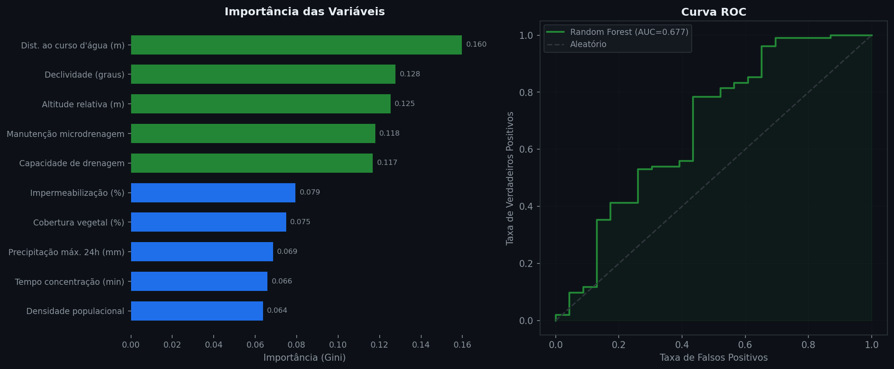

# 🌊 FloodRisk GeoML

> Mapeamento preditivo de risco de alagamento urbano com Machine Learning e dados geoespaciais — Região Metropolitana de São Paulo


---

## 🎯 Objetivo

Classificar setores censitários da RMSP por nível de risco de alagamento usando Random Forest com features geoespaciais e hidrológicas, produzindo um mapa interativo choropleth para identificação de zonas críticas.

---

## 🔍 Principais Resultados

| Métrica | Valor |
|---|---|
| Modelo | Random Forest (300 árvores) |
| ROC-AUC | 0.677 |
| CV ROC-AUC | 0.705 ± 0.071 |
| Setores analisados | 500 |
| Feature mais importante | Impermeabilização (%) |

---

## 📈 Visualizações

### Feature Importance e Curva ROC


---

## 🔬 Variáveis do Modelo

| Feature | Relevância hidrológica |
|---|---|
| Declividade (graus) | Velocidade de escoamento |
| Dist. ao curso d'água (m) | Risco de transbordamento |
| Impermeabilização (%) | Reduz infiltração |
| Altitude relativa (m) | Acúmulo de escoamento |
| Precipitação máx. 24h (mm) | Intensidade de evento extremo |
| Capacidade de drenagem | Infraestrutura instalada |
| Cobertura vegetal (%) | Permeabilidade e retenção |
| Manutenção microdrenagem | Estado operacional da rede |

---

## 🗺️ Mapa Interativo

Abra `mapa_risco.html` no browser para explorar os setores por nível de risco com popup detalhado e camada HeatMap.

---

## 🚀 Como Executar

```bash
git clone https://github.com/engenheiro80prompts/floodrisk-geoml
cd floodrisk-geoml
pip install -r requirements.txt
python generate_data.py
python train_model.py
python generate_map.py
```

---

## 📊 Fonte dos Dados

Dataset sintético baseado em variáveis hidrológicas reais da RMSP — INMET, IBGE, Defesa Civil SP.

---

## 👤 Autor

**Alexandre Miranda**
Engenheiro Civil & Orçamentista | Transição para Data Science
Python · Pandas · Machine Learning aplicado à Construção Civil e Mercado Imobiliário
